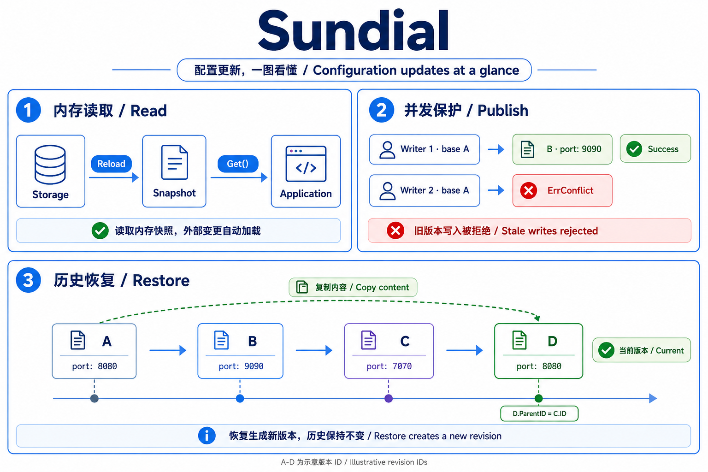

# Sundial

[](https://pkg.go.dev/github.com/sundayfun/sundial)

[English](README.md)

Sundial 是一个轻量、可扩展、类型安全的 Go 配置 SDK，提供内存读取、持久化写入
和实时更新能力。

## 为什么选择 Sundial

- **类型安全访问**：应用直接读取自己定义的配置结构体，不再使用字符串路径和 `any`。
- **快速读取**：`Get` 复制内存中已解析的配置，无需再次解码。
- **持久化写入**：`Put` 有条件地保存完整的强类型配置文档。
- **版本历史**：支持查看历史版本和恢复配置。
- **实时更新**：自动重新加载将外部变化同步到内存。
- **存储和格式可扩展**：配置源实现 `Provider`；默认使用 JSON，其他格式通过 Codec 扩展。

每个 `Client` 管理一份完整配置文档。

## 使用效果



例如，两位调用方都读取了版本 A：第一位保存后生成 B，第二位仍基于 A 写入时会收到
`ErrConflict`。之后从 C 恢复 A 的配置，会生成内容与 A 相同的新版本 D，保留完整历史。

## 安装

```sh
go get github.com/sundayfun/sundial
```

## 快速开始

以下示例读取并更新 S3 中已有的 JSON 配置。
凭据配置和首次发布见 [S3 示例](examples/s3)。

```go
package main

import (
    "context"
    "fmt"
    "log"

    s3provider "github.com/sundayfun/sundial/provider/s3"
)

type Config struct {
    Port int `json:"port"`
}

func main() {
    ctx, cancel := context.WithCancel(context.Background())
    defer cancel()

    store, err := s3provider.New[Config](ctx, &s3provider.Config{
        Region: "us-east-1",
        StorageConfig: s3provider.StorageConfig{
            Bucket:             "my-config-bucket",
            CurrentRevisionKey: "production/app/metadata.yaml",
            RevisionKeyPrefix:  "production/app/",
        },
    }, func(v Config) Config { return v })
    if err != nil {
        log.Fatal(err)
    }

    entry := store.Get()
    fmt.Println(entry.Value.Port)

    entry.Value.Port = 9090
    if _, err := store.Put(ctx, entry); err != nil {
        log.Fatal(err)
    }
}
```

必须显式提供非 nil 的 `clone` 函数，否则 `New` 返回 `ErrCloneRequired`。
本例的配置只有值字段，使用 `func(v Config) Config { return v }` 即可。
类型包含 map、slice、指针等可变引用时，需要复制所有引用的数据。
函数必须支持并发调用，不能修改输入，也不能执行编码或解码。

`Get` 返回独立的配置副本及其版本。`Put` 保存完整文档，版本过期时返回
`ErrConflict`，不会自动合并或重试。取消 context 会停止自动加载。
写入或加载失败时，保留内存中上一份有效配置。

## 文档

- [S3 示例](examples/s3)：环境配置、首次发布和条件写入。
- [API 文档](https://pkg.go.dev/github.com/sundayfun/sundial)：版本历史、Codec 和加载回调。

## 许可证

[MIT](LICENSE)
